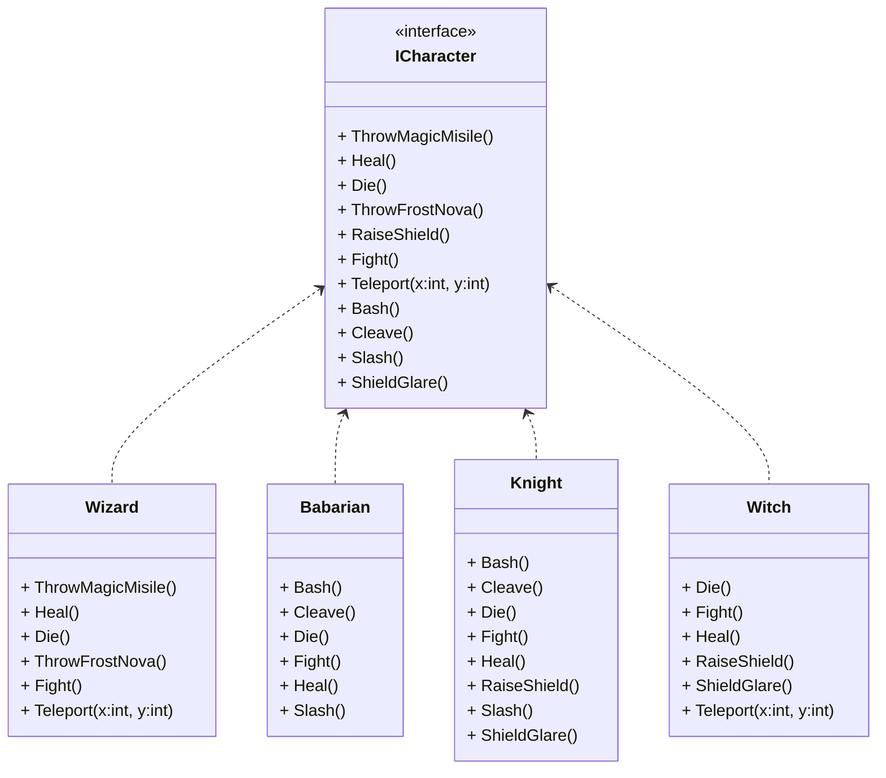

```mermaid
classDiagram
    class ICharacter{
        <<interface>>
        + ThrowMagicMisile()
        + Heal()
        + Die()
        + ThrowFrostNova()
        + RaiseShield()
        + Fight()
        + Teleport(x:int, y:int)
        + Bash()
        + Cleave()
        + Slash()
        + ShieldGlare()
    }
    class Wizard{
        + ThrowMagicMisile()
        + Heal()
        + Die()
        + ThrowFrostNova()
        + Fight()
        + Teleport(x:int, y:int)
    }
    class Babarian{
        + Bash()
        + Cleave()
        + Die()
        + Fight()
        + Heal()
        + Slash()
    }
    class Knight{
        + Bash()
        + Cleave()
        + Die()
        + Fight()
        + Heal()
        + RaiseShield()
        + Slash()
        + ShieldGlare()
    }
    class Witch{
        + Die()
        + Fight()
        + Heal()
        + RaiseShield()
        + ShieldGlare()
        + Teleport(x:int, y:int)
    }

    ICharacter <.. Wizard
    ICharacter <.. Babarian
    ICharacter <.. Knight
    ICharacter <.. Witch

```
