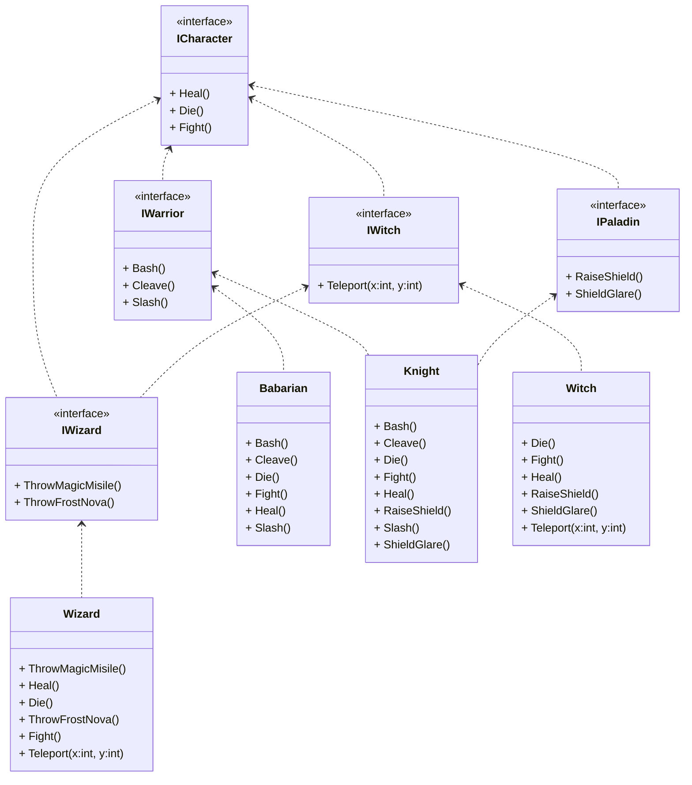

```mermaid
classDiagram
    class ICharacter{
        <<interface>>
        + Heal()
        + Die()

        + Fight()


    }
    class IWizard{
    <<interface>>
            + ThrowMagicMisile()
        + ThrowFrostNova()

        }

    class IWarrior {
        <<interface>>
                + Bash()
        + Cleave()
        + Slash()
    }
        class IPaladin {
        <<interface>>
                + RaiseShield()
                        + ShieldGlare()
    }
        class IWitch {
        <<interface>>
                + Teleport(x:int, y:int)
    }
    class Wizard{
        + ThrowMagicMisile()
        + Heal()
        + Die()
        + ThrowFrostNova()
        + Fight()
        + Teleport(x:int, y:int)
    }
    class Babarian{
        + Bash()
        + Cleave()
        + Die()
        + Fight()
        + Heal()
        + Slash()
    }
    class Knight{
        + Bash()
        + Cleave()
        + Die()
        + Fight()
        + Heal()
        + RaiseShield()
        + Slash()
        + ShieldGlare()
    }
    class Witch{
        + Die()
        + Fight()
        + Heal()
        + RaiseShield()
        + ShieldGlare()
        + Teleport(x:int, y:int)
    }

    ICharacter <.. IWizard
    ICharacter <.. IWarrior
    ICharacter <.. IPaladin
    ICharacter <.. IWitch
    IWizard <.. Wizard
    IWarrior <.. Babarian 
    IWarrior <.. Knight
    IPaladin <.. Knight
    IWitch <.. Witch
    IWitch <.. IWizard


```
